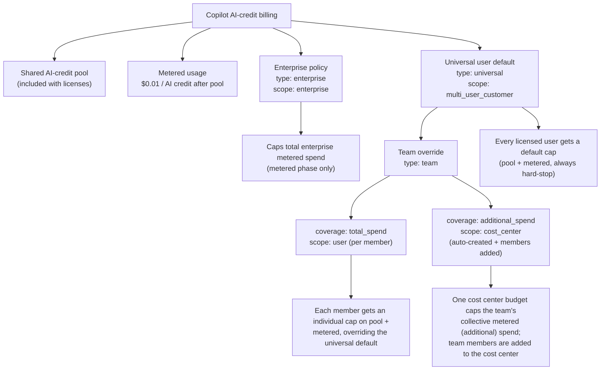
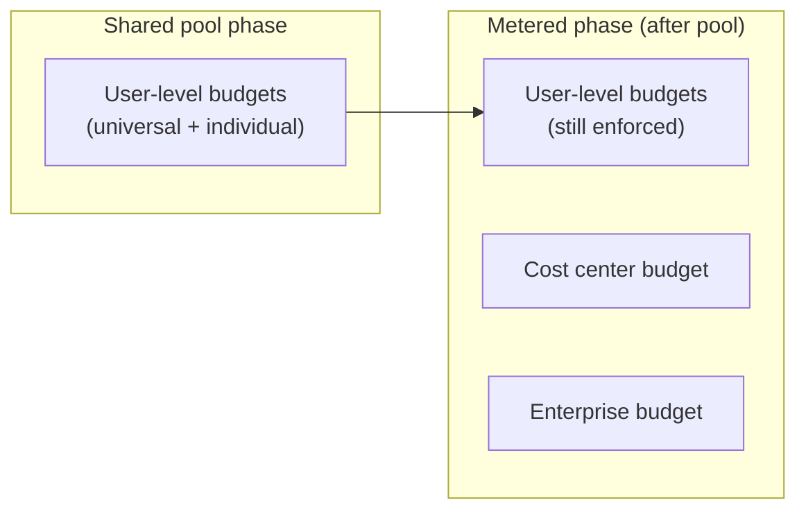
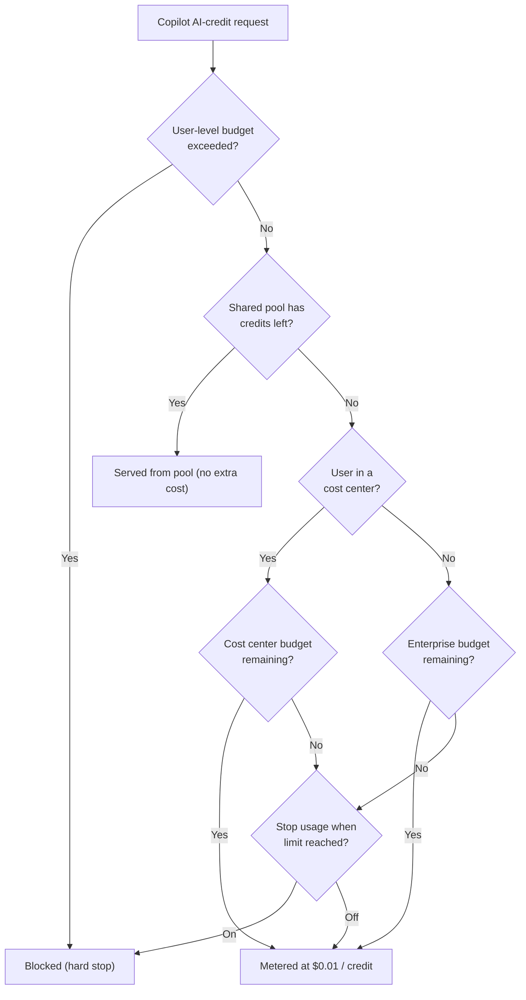

# Workflows

## Recommended operator flow

1. Edit the config file and open a pull request.
2. Run the audit workflow to confirm the config points at the expected teams, cost centers, and budget scopes.
3. Run sync/apply with `dry_run=true` and review the job summary.
4. Run the same workflow with `dry_run=false` only after the preview looks right.

For a new public fork, keep the default starter configs empty until you are ready to connect the repository to a real enterprise. Empty `mappings: []` and `budget_policies: []` files are valid and safe.

Disable scheduled runs in public demo repositories that are not connected to a real enterprise. Job summaries and audit artifacts can expose operational details once real config is added.

All workflows run on `ubuntu-24.04`. The GitHub-hosted Ubuntu 24.04 runner image already includes Bash 5.2, GitHub CLI, `jq`, and `yq`, which are the tools these scripts need.

## Config Inputs

The primary path is file-based config reviewed through pull requests. Apply and sync also support optional issue-based config for test/request scenarios:

| Workflow | File input | Issue config input |
| --- | --- | --- |
| Sync cost center members | `cost_center_members_config_file` | `cost_center_members_issue_number` |
| Apply user budgets | `budget_policies_config_file` | `budget_policies_issue_number` |
| Audit Copilot budget state | both file inputs | none |

When an issue number is provided, the workflow extracts the config YAML from the matching issue form, writes it to a temporary file on the runner, validates that file, and passes the temporary file path to the existing scripts. The script CLI flags stay stable (`--config-file`, `--teams-config-file`, and `--budgets-config-file`). For production changes, prefer config files reviewed through the repository.

Each workflow also writes the resolved config source and full YAML content to the job summary in a collapsible section. This is useful for auditability, but remember that job summaries may expose enterprise names, team names, cost center names, user logins, and budget amounts to anyone who can view the workflow run.

## Scripts at a glance

| Script | Purpose |
| --- | --- |
| `scripts/resolve-budget-policies-config.sh` | Resolves budget config from a file or config request issue and writes workflow env/summary metadata. |
| `scripts/resolve-cost-center-members-config.sh` | Resolves cost center sync config from a file or config request issue and writes workflow env/summary metadata. |
| `scripts/validate-config.sh` | Checks config shape before any API calls. |
| `scripts/audit-copilot-budget-state.sh` | Writes a markdown report under `reports/`. |
| `scripts/sync-cost-center-members.sh` | Reconciles team members into cost centers. |
| `scripts/apply-user-budgets.sh` | Creates or updates budgets without deleting extras. |

For the exact API sequence and request bodies used by these scripts, see [API reference](api-reference.md).

## `sync-cost-center-members.yml`

- Triggers: manual + daily schedule.
- If you do not use cost center member sync, keep the config file present with `mappings: []`.
- Reads team membership from either an org team (`source.org`) or enterprise team (`source.enterprise`).
- Resolves the target cost center name to its GA cost center **ID**, then reconciles members:
  - Reads current members from the cost center's `resources[]` array.
  - Adds members via `POST .../cost-centers/{cost_center_id}/resource` (body `{"users":[...]}`).
  - Removes extra members (when `remove_extra_members: true`) via `DELETE .../resource`.
- Shows the add/remove diff in dry-run mode (default); applies changes only when `dry_run=false`.

## `apply-user-budgets.yml`

- Trigger: manual.
- Creates budgets with the GA endpoint `POST /enterprises/{enterprise}/settings/billing/budgets`.
- Processes budget policy types from config, each mapping to a GA `budget_scope`:
  - `enterprise` → `budget_scope: enterprise` — caps total enterprise metered spend after the shared pool.
  - `universal` → `budget_scope: multi_user_customer` — default user-level budget for all licensed users.
  - `cost_center` → `budget_scope: cost_center` — caps a single cost center's metered spend (identified by `target.cost_center`, sent as `budget_entity_name`).
  - `team` → materialized from a team's membership in one of two ways, selected by `coverage`:
    - `coverage: total_spend` (default) → `budget_scope: user` — caps **shared pool + additional** spend by applying an individual user-level budget to each team member (overrides the universal default; always hard-stop).
    - `coverage: additional_spend` → `budget_scope: cost_center` — caps the team's **collective additional (metered)** spend with a single cost center budget. The apply step also **populates the cost center with the team's current members** (additive) so the budget caps the right people; `target.cost_center` is optional (when omitted, a name is derived as `cc-ent-{enterprise}-{team}` / `cc-org-{org}-{team}` and the cost center is **auto-created** if missing). Ongoing reconciliation (incl. removals) is handled by the sync-cost-center-members workflow. Hard stop optional.
- Copilot metered usage uses product SKU `ai_credits`. User-level budgets (`universal`, and `team` with `coverage: total_spend`) always hard-stop, so `prevent_further_usage` must be `true`.
- Dry-run prints the exact JSON payloads without calling the API.

### Issue-based config testing

Use issue-based config for test/request scenarios when you want the workflow to evaluate config from an issue:

- `apply-user-budgets.yml` accepts `budget_policies_issue_number` from the `Budget policy config request` issue form.
- `sync-cost-center-members.yml` accepts `cost_center_members_issue_number` from the `Cost center members config request` issue form.
- The issue must be open and have the expected label (`budget-policy-config` or `cost-center-members-config`).
- The workflow extracts the fenced YAML from the issue form field and writes it to `$RUNNER_TEMP`.
- The workflow comments the dry-run result back to the issue.

Issue content can be edited after creation. For this reason, issue-based runs record the issue `updatedAt` timestamp and SHA-256 hash of the extracted YAML in the summary and issue comment.

Issue-based config can be used with `dry_run=false`, but reviewed config files remain the recommended production path. If you use issue-based config for a live run, review the issue content, timestamp, SHA-256 hash, and workflow summary carefully before running.

#### Scenario: test budget policies from an issue

Use this when someone wants to preview a budget policy change without creating a branch or editing the repo config.

1. Create a new issue using the `Budget policy config request` issue form.
2. Paste a complete budget policy config into the `Budget policies YAML` field.
3. Do not assign the issue to Copilot or any coding agent. The issue is structured workflow input, not an implementation task.
4. Run `Apply user budgets` manually.
5. Set `budget_policies_issue_number` to the issue number.
6. Keep `dry_run=true` for previews. Use file-based config for normal live applies.
7. Review the job summary and the comment posted back to the issue.

The workflow enforces that the issue is open and has the `budget-policy-config` label before extracting YAML. It writes the extracted YAML to `$RUNNER_TEMP/budget-policies.yml`, validates it, and calls `scripts/apply-user-budgets.sh --config-file ...` with the workflow's selected `dry_run` value.

#### Scenario: test cost center member sync from an issue

Use this when someone wants to preview team-to-cost-center membership changes without editing the repo config.

1. Create a new issue using the `Cost center members config request` issue form.
2. Paste a complete cost center member sync config into the `Cost center members YAML` field.
3. Do not assign the issue to Copilot or any coding agent. The issue is structured workflow input, not an implementation task.
4. Run `Sync cost center members` manually.
5. Set `cost_center_members_issue_number` to the issue number.
6. Keep `dry_run=true` for previews. Use file-based config for normal live syncs.
7. Review the job summary and the comment posted back to the issue.

The workflow enforces that the issue is open and has the `cost-center-members-config` label before extracting YAML. It writes the extracted YAML to `$RUNNER_TEMP/cost-center-members.yml`, validates it, and calls `scripts/sync-cost-center-members.sh --config-file ...` with the workflow's selected `dry_run` value.

Issue-based runs are useful for experiments and review conversations. Production applies should still use file-based config reviewed through the repository.

### Budget levels tree

### Where each control applies (pool vs metered)

### Per-request billing flow

> "Lowest remaining headroom wins": whichever budget has the least capacity remaining blocks the user first. "Stop usage when budget limit is reached" applies to cost center and enterprise budgets only (off by default); user-level budgets always hard-stop.

## `audit-copilot-budget-state.yml`

- Triggers: manual + weekly schedule.
- Reads both config files and reports on team member counts, cost center member counts (resolved by cost center ID), and budget policy definitions (scope, SKU, amount, hard-stop).
- Generates markdown audit reports under `reports/`.
- Uploads reports as workflow artifacts.
- Treat audit reports as operational data. They can contain team names, cost center names, budget amounts, and user counts.
