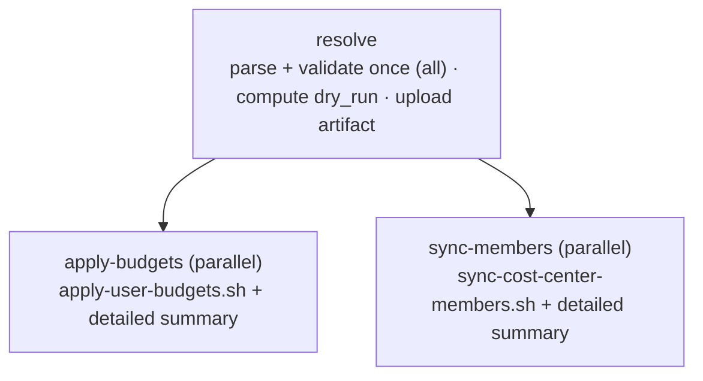
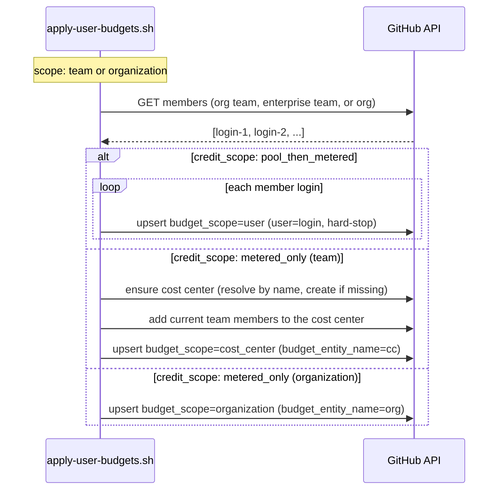
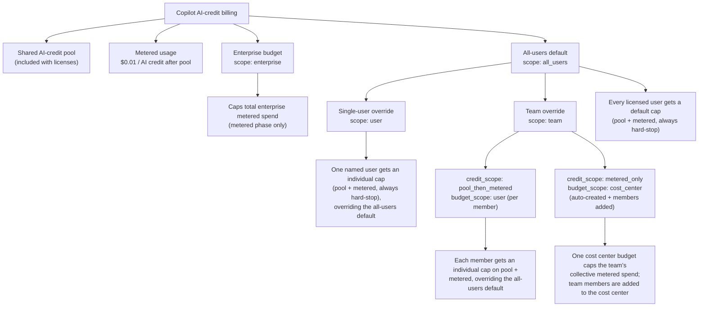
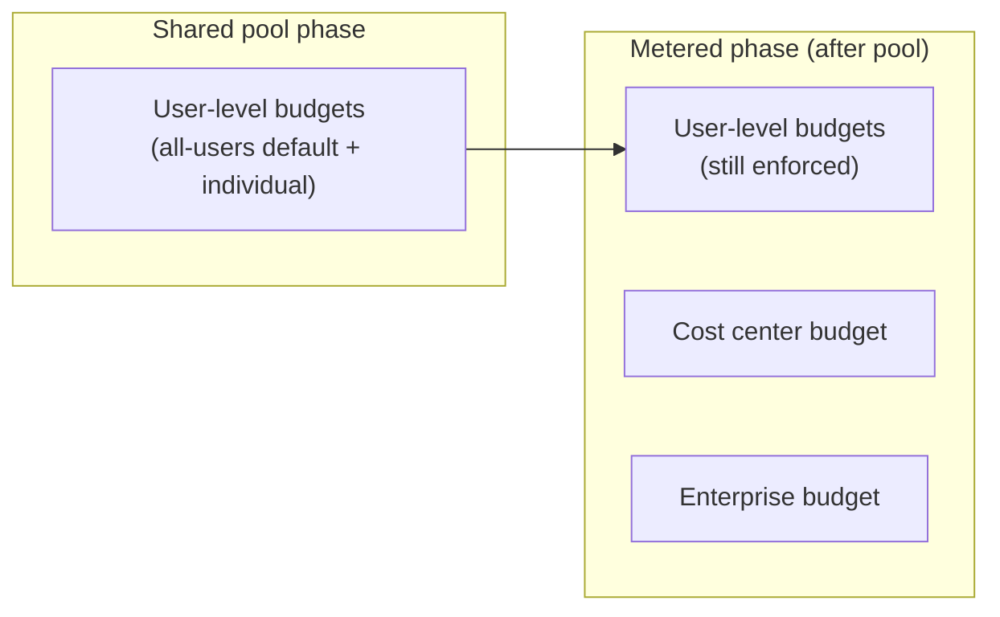
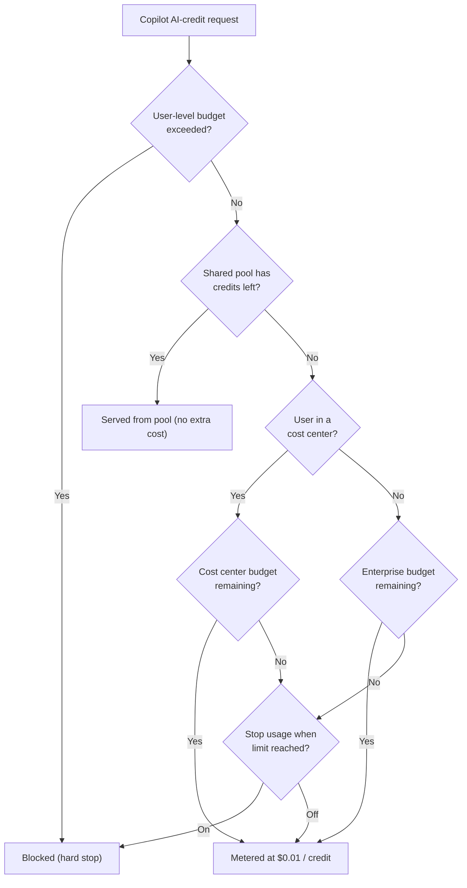

# Workflows

## Recommended operator flow

1. Edit the config file and open a pull request.
2. Run the audit workflow to confirm the config points at the expected teams, cost centers, and budget scopes.
3. Run sync/apply manually with `dry_run=true` and review the job summary.
4. Run the same workflow manually with `dry_run=false`, or enable schedules, only after the preview looks right.

For a new public fork, keep the default starter configs empty until you are ready to connect the repository to a real enterprise. Empty `mappings: []` and `budget_policies: []` files are valid and safe.

Disable scheduled runs in public demo repositories that are not connected to a real enterprise. Scheduled sync/apply runs are live once enabled, and job summaries and audit artifacts can expose operational details once real config is added.

All workflows run on `ubuntu-24.04`. The GitHub-hosted Ubuntu 24.04 runner image already includes Bash 5.2, GitHub CLI, `jq`, and `yq`, which are the tools these scripts need. Each workflow also installs `check-jsonschema` for the JSON Schema validation step.

## Config Inputs

The primary path is file-based config reviewed through pull requests. All workflows default to the v2 merged file (`config/copilot-finops.yml`). The per-type workflows also accept a unified `config_file` input and a legacy `*_config_file` input that still accepts a v1 split file (deprecated — the resolve scripts emit a deprecation notice). The per-type workflows are file-based only — issue-based testing goes through the unified workflow (see below):

| Workflow | Unified input | Legacy file input |
| --- | --- | --- |
| Sync cost center members | `config_file` | `cost_center_members_config_file` |
| Apply user budgets | `config_file` | `budget_policies_config_file` |
| Audit Copilot budget state | `config_file` | both file inputs |

The resolve scripts detect the file's `version` and emit the validate-config type (`all` for v2, `budgets`/`teams` for v1) that the workflow validate step uses.

### Unified workflow (v2 merged config)

`apply-copilot-finops.yml` is the recommended path for the v2 merged config. Instead of separate
apply and sync runs, it resolves `config/copilot-finops.yml` once and fans out:

- **One parse/extract job:** `resolve` runs `scripts/resolve-copilot-finops-config.sh` (file or
  budget/members issue), validates the merged config with type `all`, computes `dry_run`
  (schedule -> live, dispatch -> input), and uploads the resolved file as a 1-day artifact.
- **Two parallel jobs:** `apply-budgets` and `sync-members` both `needs: resolve` (not each other),
  download the artifact, and run their scripts against the same resolved file. Each writes its own
  detailed `$GITHUB_STEP_SUMMARY` via `apply-summary.jq` / `sync-summary.jq` plus a collapsible log.
- **v2 only:** the resolver rejects a v1 file with a clear message; use the per-type workflows for v1.
- **Testing-only issue input:** the unified workflow is file-based (the enterprise slug and policies come from the config). An optional `issue_number` resolves config from the `Copilot FinOps config request` issue (label `copilot-finops-config`) for testing only (schedules never set it). A merged config with one omitted list simply makes that job a friendly no-op.
- **Parallel tradeoff:** apply and sync run concurrently (both idempotent; apply self-populates cost
  centers for metered-only team budgets), so there is no enforced sync-before-apply ordering.

When an issue number is provided, the workflow extracts the config YAML from the matching issue form, writes it to a temporary file on the runner, validates that file, and passes the temporary file path to the existing scripts. The script CLI flags stay stable (`--config-file`, `--teams-config-file`, and `--budgets-config-file`). For production changes, prefer config files reviewed through the repository.

Each workflow also writes the resolved config source and full YAML content to the job summary in a collapsible section. This is useful for auditability, but remember that job summaries may expose enterprise names, team names, cost center names, user logins, and budget amounts to anyone who can view the workflow run.

## Scripts at a glance

| Script | Purpose |
| --- | --- |
| `scripts/resolve-budget-policies-config.sh` | Resolves budget config from a file and writes workflow env/summary metadata (file-based; per-type workflow). |
| `scripts/resolve-cost-center-members-config.sh` | Resolves cost center sync config from a file and writes workflow env/summary metadata (file-based; per-type workflow). |
| `scripts/resolve-copilot-finops-config.sh` | Resolves the merged v2 config from a file or the unified `Copilot FinOps config request` issue (one normalized `COPILOT_FINOPS_*` env set), for the unified workflow. |
| `scripts/migrate-v1-to-v2.sh` | One-shot migration aid: converts a v1 budgets + members pair into the merged v2 config (stdout or `--output`). |
| `scripts/validate-config.sh` | Validates config against the versioned JSON Schema (`schemas/v<N>/`) and the semantic cross-field rules before any API calls. |
| `scripts/audit-copilot-budget-state.sh` | Writes a markdown report under `reports/`. |
| `scripts/sync-cost-center-members.sh` | Reconciles team members into cost centers. |
| `scripts/apply-user-budgets.sh` | Creates or updates budgets without deleting extras. |

For the exact API sequence and request bodies used by these scripts, see [API reference](api-reference.md).

## `sync-cost-center-members.yml`

- Triggers: manual + daily schedule at 03:17 UTC.
- Scheduled runs use file-based config and force `dry_run=false` to reconcile live cost center membership.
- If you do not use cost center member sync, keep the config present with `team_cost_center_mappings: []` (v2) or `mappings: []` (v1).
- Reads team membership from either an org team (`organization:` set) or an enterprise team (no `organization:`; the enterprise is inferred).
- Resolves the target cost center name to its GA cost center **ID**, then reconciles members:
  - Reads current members from the cost center's `resources[]` array.
  - Adds members via `POST .../cost-centers/{cost_center_id}/resource` (body `{"users":[...]}`).
  - Removes extra members (when `remove_extra_members: true`) via `DELETE .../resource`.
- Manual dry-runs show the add/remove diff; live runs apply changes when `dry_run=false`.

## `apply-user-budgets.yml`

- Triggers: manual + daily schedule at 04:47 UTC, after the cost center member sync schedule.
- Scheduled runs use file-based config and force `dry_run=false` to reconcile live budget policy state after member sync.
- Creates budgets with the GA endpoint `POST /enterprises/{enterprise}/settings/billing/budgets`.
- Processes budget policies from config, each mapping to a GA `budget_scope` (v2 `scope` shown; v1 `type` in parentheses):
  - `enterprise` → `budget_scope: enterprise` — caps total enterprise metered spend after the shared pool.
  - `all_users` (v1 `universal`) → `budget_scope: multi_user_customer` — default user-level budget for all licensed users.
  - `user` → `budget_scope: user` — one hard-stop budget per login in `users:`, on the enterprise endpoint.
  - `cost_center` → `budget_scope: cost_center` — caps a single cost center's metered spend (identified by `cost_center`, sent as `budget_entity_name`).
  - `team` → applied to each team in `teams:`, materialized in one of two ways, selected by `credit_scope` (v1 `coverage`):
    - `pool_then_metered` (v1 `total_spend`) → `budget_scope: user` — caps **shared pool + metered** spend by applying an individual user-level budget to each team member (members are unioned + deduped across the listed teams; overrides the all-users default; always hard-stop).
    - `metered_only` (v1 `additional_spend`) → `budget_scope: cost_center` — caps each listed team's **collective metered** spend with one cost center budget per team. The apply step also **populates each cost center with that team's current members** (additive) so the budget caps the right people; `cost_center` is optional and only allowed with a single team (when omitted, or with multiple teams, a name is derived as `cc-ent-{enterprise}-{team}` / `cc-org-{org}-{team}` and the cost center is **auto-created** if missing). Ongoing reconciliation (incl. removals) is handled by the sync-cost-center-members workflow. Hard stop optional.
  - `organization` → an org's budget, **written on the org billing endpoint** `POST /organizations/{org}/settings/billing/budgets` (its parent is the org). Dual-track like a team, by `credit_scope`:
    - `pool_then_metered` → `budget_scope: user` per org member (read from `/orgs/{org}/members`; always hard-stop).
    - `metered_only` → one `budget_scope: organization` budget for the org's collective metered spend (no cost center).
- **Conflicts:** GHE forbids duplicate budgets for one entity. A read-only pre-flight flags any login individually budgeted by 2+ policies (a `scope: user` login and/or a team/organization `pool_then_metered` member); the **last policy in config order wins**, earlier ones are skipped, and every collision is shown in a Conflicts section of the job summary (user-vs-cost-center overlaps are flagged as informational).
- Copilot metered usage uses product SKU `ai_credits`. User-level budgets (`all_users`, and `team`/`organization` with the `pool_then_metered` track) always hard-stop, so `prevent_further_usage` must be `true`.
- Dry-run prints the exact JSON payloads without calling the API.

### Policy scope → GHE budget (implementation)

These diagrams show how `scripts/apply-user-budgets.sh` technically turns one config policy into one
or more GitHub Enterprise (GHE) budgets, so you can see exactly what the apply step will do before it
runs. They map a policy's `scope` (and `credit_scope`) to the resolved **billing endpoint**, the GHE
**`budget_scope`**, and the **entity field** sent in the request body.

#### 1. Scope → endpoint + budget_scope + entity field

```mermaid
flowchart TD
  CFG["Policy in config<br/>scope + amount + (credit_scope)"] --> SC{"scope?"}

  SC -->|all_users| AU["budget_scope: multi_user_customer<br/>(no entity field)<br/>always hard-stop"]
  SC -->|enterprise| EN["budget_scope: enterprise<br/>(no entity field)"]
  SC -->|user| US["budget_scope: user &times; N<br/>user = login (hard-stop)"]
  SC -->|cost_center| CCM["resolve cost_center name &rarr; ID<br/>budget_scope: cost_center<br/>budget_entity_name = cc ID"]
  SC -->|team| TM{"credit_scope?"}
  SC -->|organization| OR{"credit_scope?"}

  TM -->|pool_then_metered| TU["union team members<br/>budget_scope: user &times; N<br/>user = login (hard-stop)"]
  TM -->|metered_only| TC["per team: ensure + populate cost center<br/>budget_scope: cost_center<br/>budget_entity_name = cc ID"]

  OR -->|pool_then_metered| OU["read org members<br/>budget_scope: user &times; N<br/>user = login (hard-stop)"]
  OR -->|metered_only| OO["budget_scope: organization<br/>budget_entity_name = org login"]

  AU --> EEP["POST /enterprises/&#123;enterprise&#125;/settings/billing/budgets"]
  EN --> EEP
  US --> EEP
  CCM --> EEP
  TU --> EEP
  TC --> EEP

  OU --> OEP["POST /organizations/&#123;org&#125;/settings/billing/budgets"]
  OO --> OEP
```

Every request body also carries `budget_amount` (whole USD), `budget_product_sku: ai_credits`,
`budget_type: BundlePricing`, `prevent_further_usage` (the hard-stop), and `budget_alerting`
(`will_alert` + `alert_recipients`). Only `cost_center`/`team metered_only` send `budget_entity_name`
(a cost center); only `organization metered_only` sends `budget_entity_name` (the org login); only
the per-member tracks and `scope: user` send `user`.

#### 2. Reconciliation — how apply decides CREATE / UPDATE / no change

GHE budgets have no name field, so the apply step matches **desired vs. live** state by natural key.
It lists existing budgets once per endpoint, then for each materialized budget:

```mermaid
flowchart TD
  M["Each materialized budget"] --> L["List existing budgets once<br/>(cached per endpoint)"]
  L --> K["Match by natural key:<br/>budget_scope + product_sku<br/>+ (user | budget_entity_name)"]
  K --> Q{"Match found?"}
  Q -->|No| CR["CREATE<br/>POST .../budgets"]
  Q -->|Yes| D{"amount / hard-stop /<br/>alerting differ?"}
  D -->|Yes| PA["UPDATE mutable fields only<br/>PATCH .../budgets/&#123;id&#125;"]
  D -->|No| NC["No change (idempotent)"]
  CR --> SUM["Recorded in the job summary"]
  PA --> SUM
  NC --> SUM
```

> The apply step **never deletes** budgets. A budget removed from config is left in place; clean it up
> manually with `DELETE .../budgets/{budget_id}` after review. In `dry_run=true` mode every branch is
> computed and printed (`Would create` / `Would update` / `No change`) but no request is sent.

#### 3. Dual-track materialization (team / organization membership expansion)

`team` and `organization` policies fan a single config entry out across live membership. This is the
step that turns one policy into N budgets:

Membership sources: an org team reads `GET /orgs/{org}/teams/{team}/members`, an enterprise team
reads `GET /enterprises/{enterprise}/teams/{team}/memberships`, and a `scope: organization` policy
reads `GET /orgs/{org}/members`. For a `team metered_only` budget, the apply step populates the cost
center additively; ongoing removals are handled by the sync-cost-center-members workflow.

### Issue-based config testing (unified workflow)

Issue-based config is for test/request scenarios; reviewed config files remain the recommended production path. There is one issue form, consumed only by the unified `apply-copilot-finops.yml` workflow:

1. Create a new issue with the `Copilot FinOps config request` form (label `copilot-finops-config`).
2. Paste one complete v2 config into the `Copilot FinOps config YAML` field. Populate `ai_credit_spend_policies` and/or `team_cost_center_mappings` — a list you omit just makes that half a no-op.
3. Do not assign the issue to Copilot or any coding agent. It is structured workflow input, not an implementation task.
4. Run `Apply Copilot FinOps` manually and set `issue_number` to the issue number. Keep `dry_run=true` for previews.
5. Review both job summaries (budgets + members).

The resolver enforces that the issue is open and carries the `copilot-finops-config` label, extracts the fenced YAML to `$RUNNER_TEMP/copilot-finops.yml`, validates it (`version: 2`), and runs both jobs against it. Because issue content can be edited after creation, the resolver records the issue `updatedAt` timestamp and the SHA-256 of the extracted YAML in the job summary, so a live issue-based run can be audited before trusting it.

The per-type `apply-user-budgets.yml` and `sync-cost-center-members.yml` workflows are file-based only.

### Budget levels tree

### Where each control applies (pool vs metered)

### Per-request billing flow

> "Lowest remaining headroom wins": whichever budget has the least capacity remaining blocks the user first. "Stop usage when budget limit is reached" applies to cost center and enterprise budgets only (off by default); user-level budgets always hard-stop.

## `audit-copilot-budget-state.yml`

- Triggers: manual + weekly schedule on Monday at 12:23 UTC.
- Reads both config files and reports on team member counts, cost center member counts (resolved by cost center ID), and budget policy definitions (scope, SKU, amount, hard-stop).
- Generates markdown audit reports under `reports/`.
- Uploads reports as workflow artifacts.
- Treat audit reports as operational data. They can contain team names, cost center names, budget amounts, and user counts.
